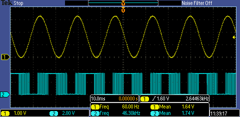
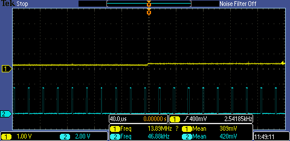
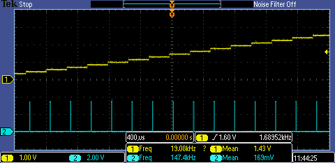

# PSI3441-FRDM

## Summary

Freescale CodeWarrior 10.7 project for the FRDM-FL25Z [1, 2, 3]. This project models the operation of a three-phase PMSM driver with back-EMF sensing through some MCU navel-gazing.

In a nutshell, the MCU's DAC generates a 60 Hz sine wave, which is then sampled by the ADC (a jumper wire is required for this connection). After some signal processing, which may include FIR filters and [adjustable] phase shifters, the processed sine wave is passed to a timer for PWM generation.

## Description

### Overview

Permanent magnet synchronous motor (PMSM) drivers with back-EMF sensing operate by measuring the EMF on the undriven phase of the motor. The sampled signal is filtered, multiplied by a gain coefficient, and shifted by a given phase, before being realized through PWM, typically to drive power FETs.

This system aims to emulate this behavior. The DAC emulates the back-EMF signal (the switching between phases is not modelled), which is sampled by the ADC. The processed sine wave for one of the driven phases is then realized through PWM.

System performance is currently limited by PWM carrier frequency. The PWM carrier is generated by a peripheral counter counting up, then down. The carrier frequency is thus determined by the counter modulo (the value at which it changes direction).

However, the output pin is set LOW (turning on the blue LED) when the value in the output compare buffer is higher than the carrier (counter) value. The number of possible values for the output duty cycle is thus roughly equal to the counter modulo. Therefore, there is a fundamental tradeoff between output precision and carrier frequency.

According to Kastha et al. [4], carrier frequency must be several orders of magnitude higher than the output refresh rate, thus limiting ADC and DAC frequencies at well.

### DAC

The DAC drives a 60 Hz sine wave from a 64-word value table stored in memory with the help of the DMA's Channel 1 triggered at 3.84 kHz by the TPM1 overflow.

The `DMA1_IRQHandler` ISR restarts the DMA channel after a large number of transfers (since it cannot be kept on indefinitely).

**Note:** As described in the KL25Z's Errata 5746 [5], the DMA cycle-steal periodic (PIT) trigger operation is faulty. The TPM triggering described above is the recommended workaround.

### ADC

The TPM2-triggered ADC fills a 64-word buffer in memory through interrupt servicing at 3.84 kHz.

For modularity reasons, even though ADC and DAC frequencies can be identical, different timers are used for triggering. This can later be changed if necessary, as using different timers could arguably generate race conditions.

### PWM

The TPM0 generates an ADC-generated DMA-driven variable duty-cycle center-aligned PWM with a 46.875 kHz carrier frequency and an 8-bit output resolution. The duty cycle is refreshed at the same frequency, and from the same timer, as the ADC conversion.

The `DMA0_IRQHandler` ISR restarts the DMA channel after a large number of transfers (since it cannot be kept on indefinitely).

**Note:** The `Init_TPM` component, which is the only one that supports center-aligned PWM mode, is buggy. Make sure to call the `TPM0_FixPWM` method.

### Signal processing

At this time, signal processing consists in discarding the LSBs of the ADC to fit the PWM 8-bit output resolution.

A suitable FIR filter that respects both performance and delay constraints has not been found. The use of IIR filters has not been explored.

### Phase delay

Phase delay between input and output waveforms is set at a nominal 120 degrees, corresponding to 21.33 samples.

One sample is always lost as the PWM register is only updated on the next timer event. This places a tight constraint on maximum FIR filter delay (20 samples, or 41 taps).

The actual phase delay is currently set to 1+20 samples, i.e. 118.125 degrees.

")

")

### Figure of merit

Pin 10 of connector J2 (PTD3) is used to output the processor load state: whenever the processor enters an ISR or leaves its idle loop, the output is set. Measuring the pin's duty cycle with the help of an oscilloscope provides a simple, yet effective, figure of merit (FoM).

")

## Setup

### Build instructions

Import and build project with CodeWarrior 10.7 or higher.

### Hardware setup

The DAC output is available on pin 11 of connector J10. The blue LED (active LOW) is available on pin 12 of connector J2. The ADC input is available on pin 2 of connector J10. The FoM indicator is available on pin 10 of connector J2.

In order for the system to work, the DAC output must be linked to the ADC input with the help of a jumper wire. The DAC output can otherwise be visualized by connecting it to the blue LED pin. Care must be taken to redirect PWM output in this case, as it is currently routed to the blue LED.

Raising the prescalers of both TPM1 and TPM2 to 128 (from their original value of 1) constitutes an easy method to slow output enough to be visible on the blue board LED.

## References

[1] *FRDM-KL25Z User's Manual*. Freescale Semiconductor. October 2014.

[2] *Kinetis KL25 Sub-Family: Data Sheet*. Freescale Semiconductor. August 2014.

[3] *Kinetis KL25 Sub-Family: Reference Manual*. Freescale Semiconductor. September 2012.

[4] D. Kastha, D. Prasad, N. K. De, and S. Sengupta. Lesson 37: Sine PWM and its Realization. *Power Electronics (Web Course): Lecture Notes*. Indian Institute of Technology Kharagpur. http://nptel.ac.in/downloads/108105066/ (2018-05-08).

[5] *Mask Set Errata for Mask 2N97F*. Freescale Semiconductor. July 2013.
